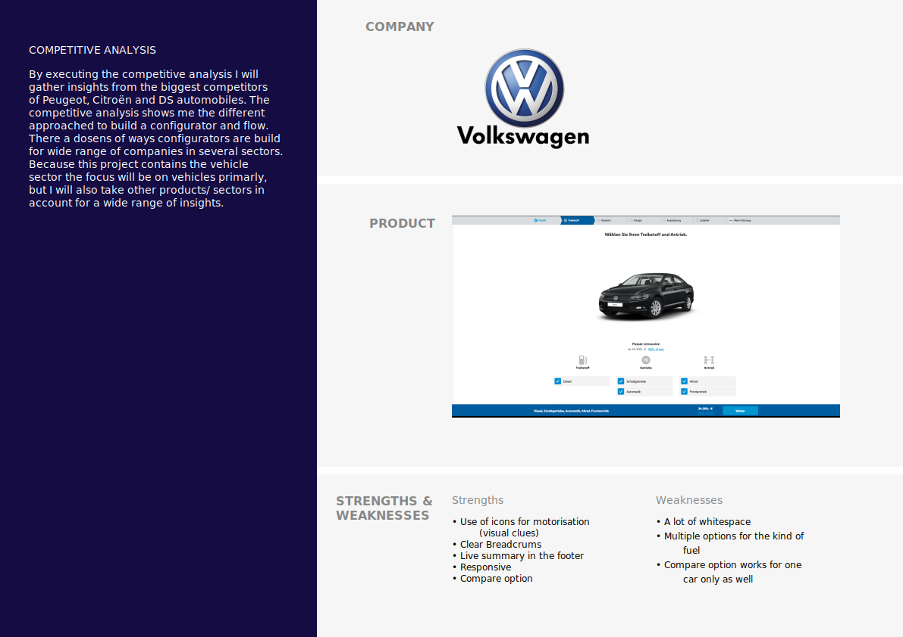
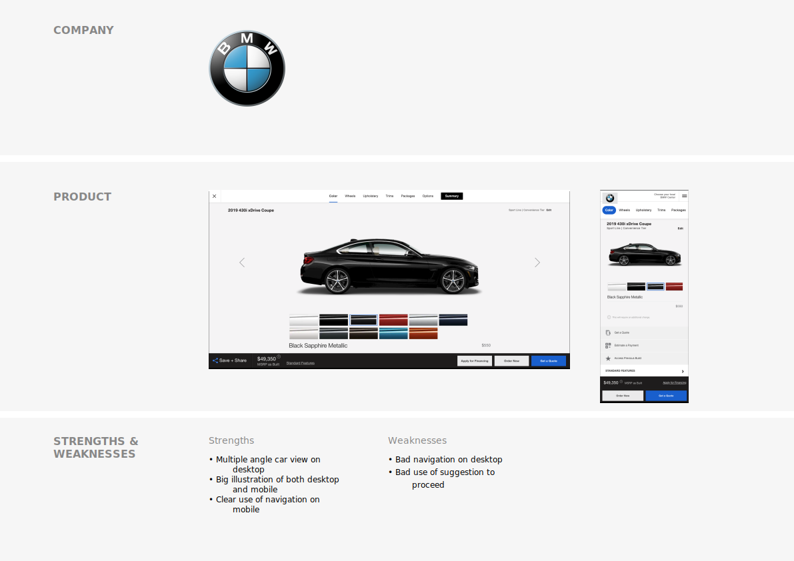
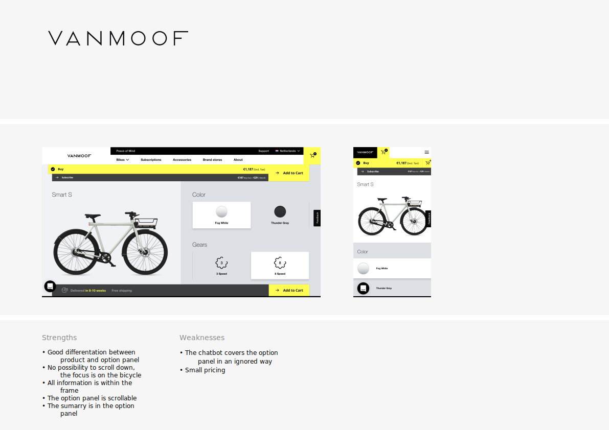
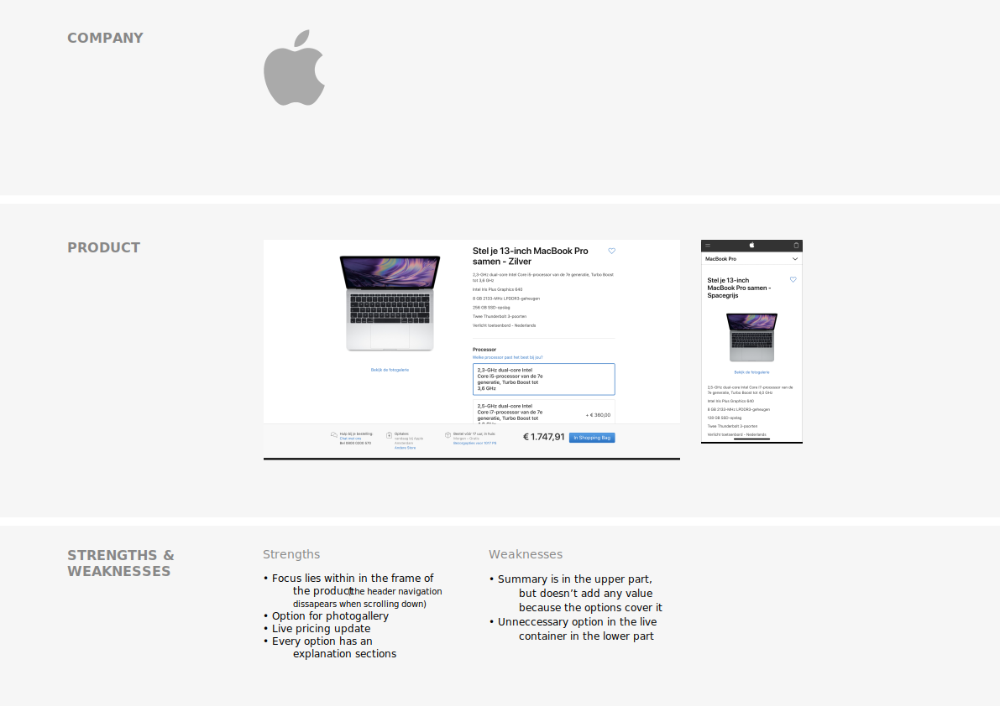
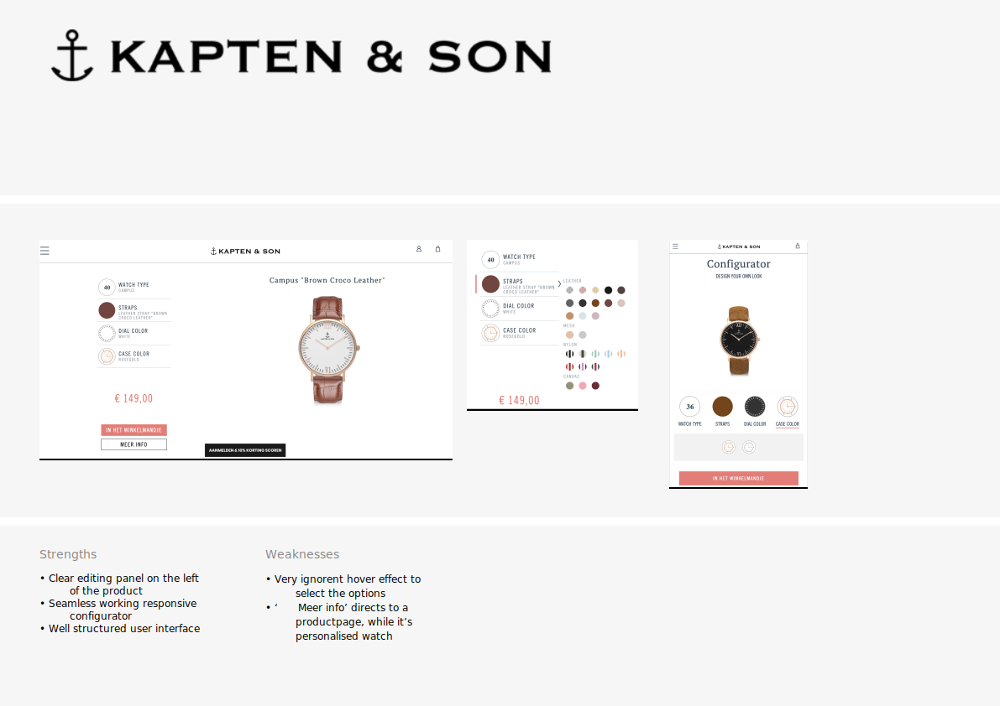
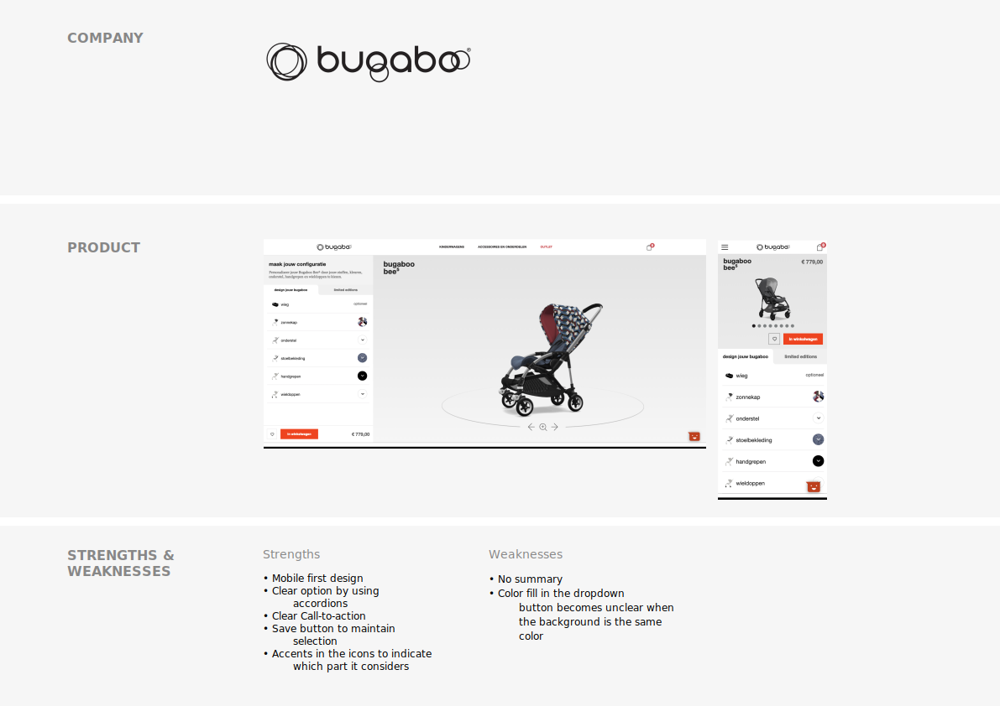

# Competitive Analysis

#### Competitive Analysis

By executing the competitive analysis I will gather insights from the biggest competitors of Peugeot, Citroën and DS automobiles. The competitive analysis shows me the different approached to build a configurator and flow. There a dozens of ways configurators are build for wide range of companies in several sectors. Because this project contains the vehicle sector the focus will be on vehicles primarily, but I will also take other products/ sectors in account for a wide range of insights.



