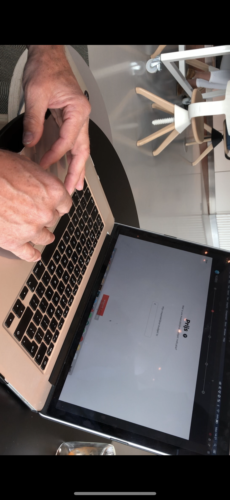

# Stakeholder-map

#### Introduction

The Employee Benefit Program was set up by Peugeot. Peugeot has multiple collaborations to realise the program. Also, there are outside parties that influence the program. To get a clear overview of all the parties and their level over influence and impact, I created a stakeholder-map. The core of the circle represents the Employee Benefit Program, all parties have a level of influence or impact. The place of the parties in the circle depends on that level.

