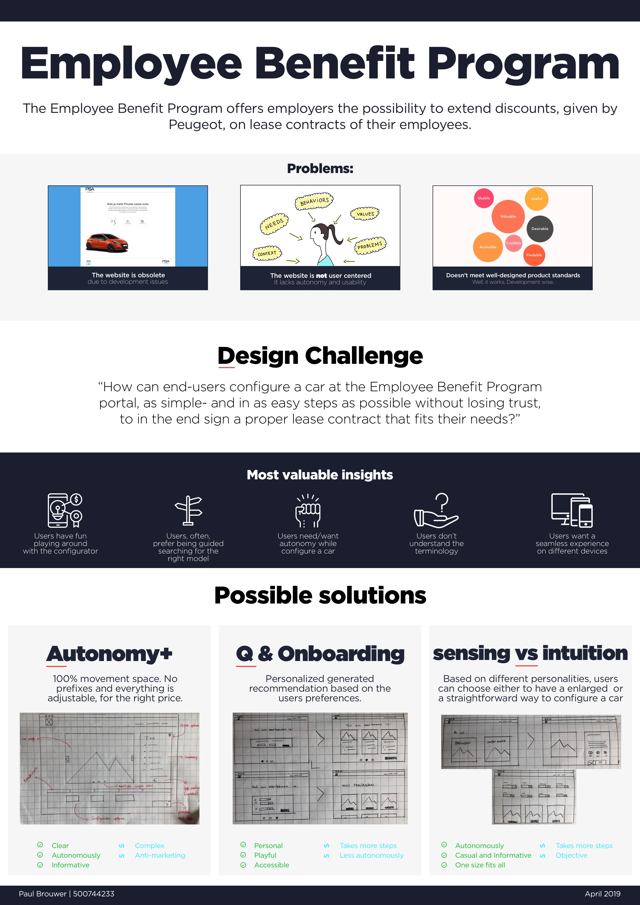
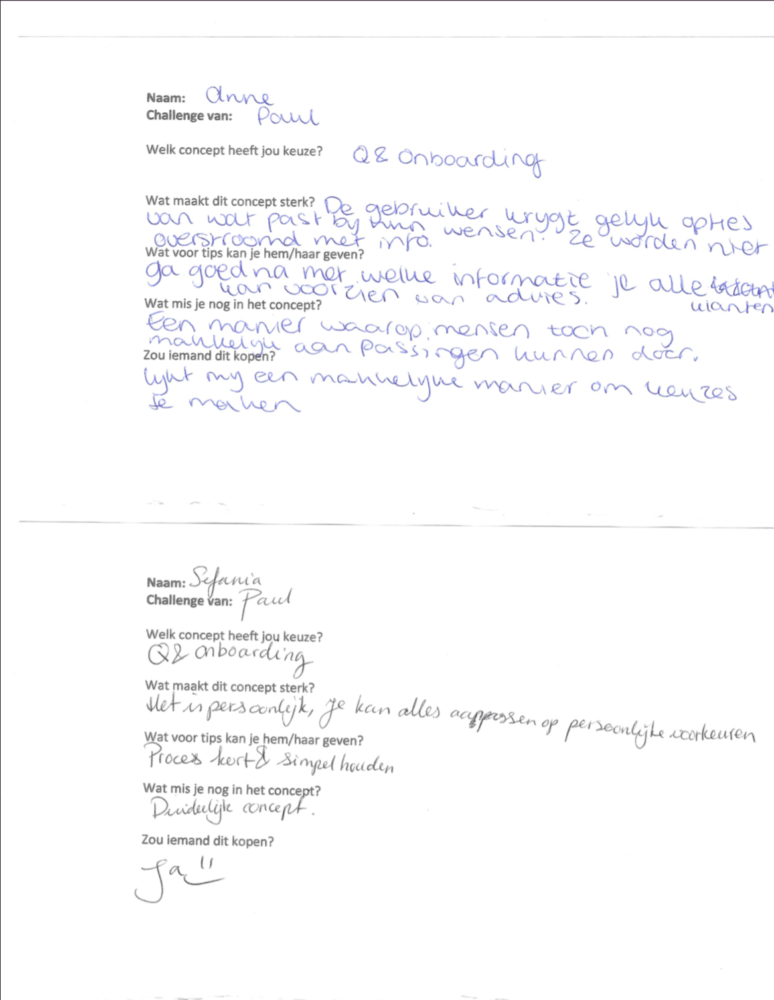
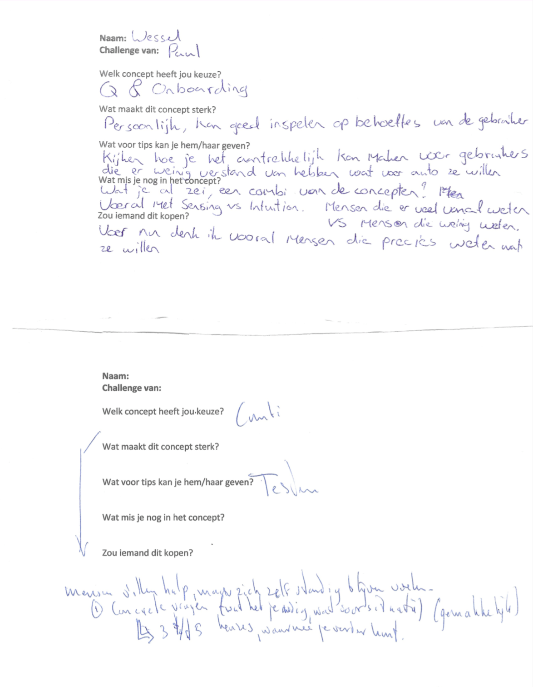
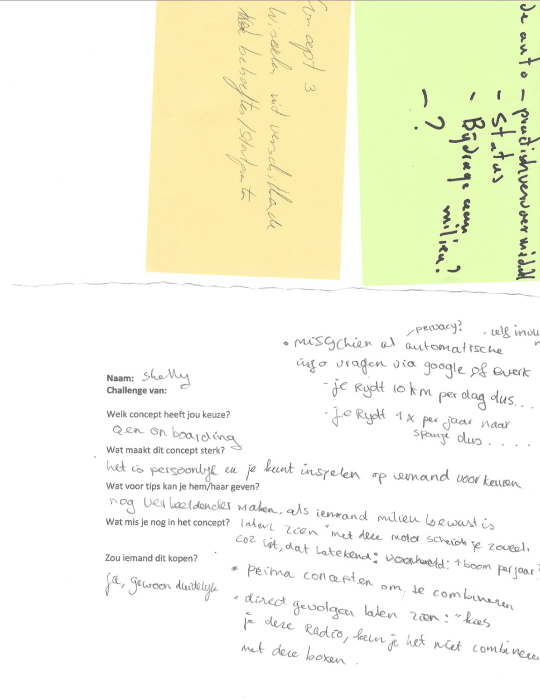

# Feedback Frenzy

#### Introduction

Peer feedback is one of the most valuable criteria to improve your product. During the Feedback Frenzy, my peers and I got the opportunity to present our work intermediate. Based on the first phase, the research phase, everybody came up with one to three concepts. Within 5 to 10 minutes everybody got to explain their work and ask questions. Afterwards, all peers could choose which concept would be best. Every peer had to fill in five short questions, which contained for example; Which are the strengths of this concept and do you have tips for you peer?

## Frenzy

I presented my three ideas: Autonomy+, Q&Onboarding and Sensing vs Intuition. Throughout my research, I gathered the most valuable insights which supported my concepts best. In addition, I wrote down the positives and negatives about the concepts and during my presentation, I told how the three concepts, in the end, could be combined. Based on that, my peers gave me feedback.

  
As I thought, the most potential concept I created was Q&Onboarding. As Q&Onboarding provides users guidance and, at the same time, can ensure autonomy by providing skipping options. Therefore it was clearly the most accessible idea. When the peers were asked what makes this concept powerful, five out of five peers mentioned the personal aspect. Because the user starts with a short onboarding with three to five questions it can determine which cars can be excluded and therefore provide a better overall offer. 

  
Autonomy+ on the other hand, is user preferences based, but one of my peers mentioned that users like to be autonomous but only to a certain point. So if the users need to choose every single thing it might to become to complex. Users do prefer making their own decisions but in this case, configure a car, the options are endless. My peers, therefore, recommended to limit the autonomy. 

  
As for tips, my peers recommended keeping the questions short with a maximum of five. Also, my peers suggested that when asking questions I really should take the method into account. For example, when somebody wants a CO2 friendly car or on the other hand a fast one. "How do you keep users interested and how do you give the best advice?", are the biggest challenges within this questionnaire. From this point, I decided to continue working on the Q&Onboarding concept.   

