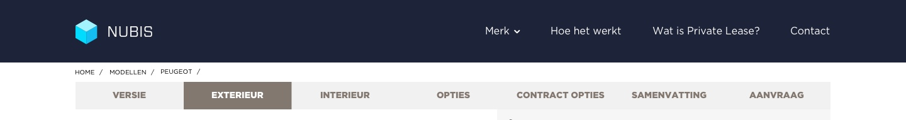

# High fidelity Prototype V2

The first version of the configurator contained, still, a lot of features and options that were visualised at once. All these features and options made the layout too noisy. Too improve this layout, I wanted to make it more 'breath'. In this case, I wanted to make the configurator more accessible by adding more white space and reorganise the content in a way the user would not be overwhelmed with all the features and options at once. Therefore, I created a new layout that was more easy to use and still provides all the usability of the first version. While the portal as a did not had be improved, I could focus on the configurator.

### Overall changes

#### Breadcrumbs

First of all, for all steps through the process, I edited the layout as a whole. The make the more design more breath, I wanted the primarily color to be white. Secondly, I wanted to create more focus on the configuration. Therefore, I decided to remove the header navigation, which meant I only left the breadcrumbs \(breadcrumbs tell users at which step of the process they are located\) at the top of the page. By removing the header navigation, I took the risk that users could feel stuck. Too prevent users to get stuck, I needed to create a way out which was accessible at all time. As a solution for the problem I created a fixed button \(A that button will always be visible whenever users scroll down\), that said: 'Back to home'. Because this button is fixed, users would always be able to leave the configurator and return to the Employee Benefit Program portal page. 

At the same time I decide to remove the header navigation, I also decided to edit the breadcrumbs. In the first version, I used three upper navigations: the header navigation, the website breadcrumbs \(to indicate the location of the user at the website\), and the configurator breadcrumbs. As seen in the image below, the three levels of navigations confiscated a big part of the layout of the configurator. In addition, while there are three levels of navigation, I also implemented five different colors: black, navy, gray, brown and white.

Confiscating layout space and use of color, made me realise the configutor layout needed to be edited. Therefore, I made white color based breadcrumbs less color differences. In the first place, the background color was changed to white, to make this primarily. Secondly, to indicate at which step of the process the user was located, I changed the layout of the step that is active \(active state\). In the first version I designed the active step to have brown background, with a big uppercase font. Too comply with the new challenge; make the layout more breath, I edited the active state, by giving a red underline. This made the indication more subtle, and still recognisable due to the white background space. As third, to add more focus on the active state, I decided to make the changed to opacity of the other, not yet confirmed steps, to 50%. This brings me to the last change. While the steps that not have been confirmed yet got 50% opacity, I designed an indication of the confirmed steps, at the same time. Namely, when a user gets from step one to two, the first step remains the full 100% color. This will guide the users that the steps before the active state are already have been confirmed, and the steps after the active step still need to be confirmed.

#### Footer section

The second important change of the layout was the footer - a web page footer contains information listed at the bottom of the page, of the configurator. \(Smallbusiness, 2019\) The footer is also treated as its own section of the web page, separate from the header, content and sidebars\)The function of the footer was to, constantly, indicate \(I\) the name and version of the model of chosen car, \(II\) the total sum of the price of the configured car, \(III\) the option to view the summary of the configured car, \(IV\) and lastly the option to go to the next step. 

In the first layout, I designed the footer to be white as a primarily color. This meant, I actually did not had to change the layout to my new ideas. Although, because the footer has an essential functionality, I decided to be the focus of the configurator. Therefore, I designed the footer to be colored, in a way it seeks attention. The navy and red colors of the PSA brand identity perfectly contributed to seeking attention. I used navy to be the background color and red for the call to action - an instruction to the audience designed to provoke an immediate response. \(Wikipedia, 2019\)

As second, I change the title of the chosen model. Whereas the first contained the brand name, model, version and amount of doors, I now left out the amount of doors to leave more focus on the title of the car. Users now needed to access the summary of the car to see the amount of doors. 

This brings me to the third change in the footer layout. In the first version I used a small chevron icon in combination with the word 'summary'. However, it made the summary easy accesible, it was not very recognisable. Therefore, I decided to make it bigger and remove te chevron. In the second version the summary button now only uses underlined words and says 'View summary'. In this way the summary was more noticeable and, because I made it bigger, more accesible to click. 

Lastly, the 'direct request' was removed at the footer and replaced with a next step button. The reason I decided to remove the 'direct request' was to guide user to finish the whole process. The direct request button, also, is now accesible at the summary page. From there, the user has a clear overview of the configured car and can then decide whether to request or finish the process. 

#### Duration  & Mileage

Another small part of the layout I changed, was the selection duration and mileage. In the first version the duration and mileage section was small and hard to read. It did not take the whole car section width, which therefore became a floating piece of content. The second version made more user of space. It took the whole car section width and at the same time, made use of more white space. I added more white space to the captions 'duration'  and 'mileage' and made the captions bold. Additionally, I changed the way users could change both amounts. In the first version, the users had very small minus and plus icons to click on, which were hardly accesible. in the ==

