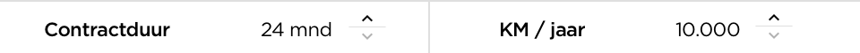
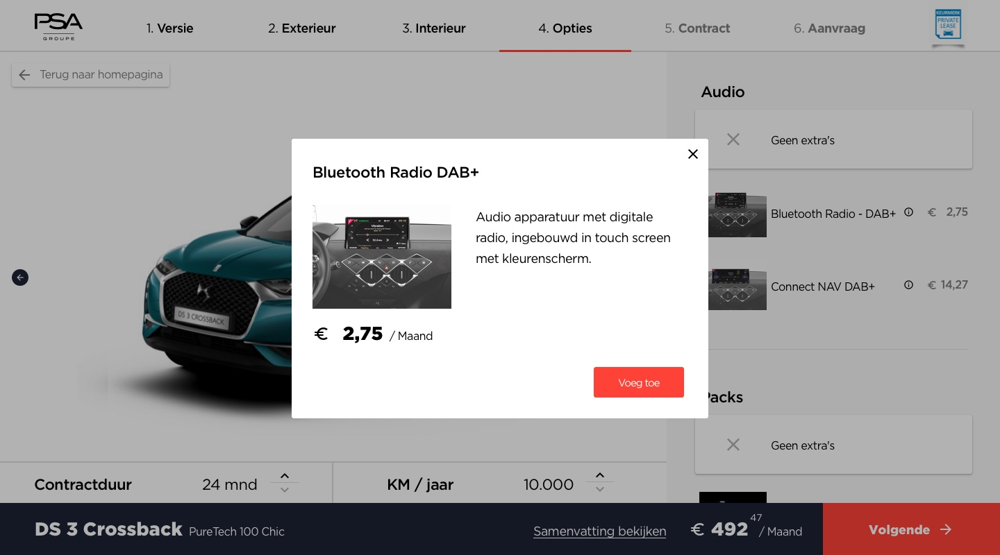

# High fidelity Prototype V2

The first version of the configurator contained, still, a lot of features and options that were visualised at once. All these features and options made the layout too noisy. Too improve this layout, I wanted to make it more 'breath'. In this case, I wanted to make the configurator more accessible by adding more white space and reorganise the content in a way the user would not be overwhelmed with all the features and options at once. Therefore, I created a new layout that was more easy to use and still provides all the usability of the first version. While the portal as a did not had be improved, I could focus on the configurator.

### Overall changes

#### Breadcrumbs

First of all, for all steps through the process, I edited the layout as a whole. The make the more design more breath, I wanted the primarily color to be white. Secondly, I wanted to create more focus on the configuration. Therefore, I decided to remove the header navigation, which meant I only left the breadcrumbs \(breadcrumbs tell users at which step of the process they are located\) at the top of the page. By removing the header navigation, I took the risk that users could feel stuck. Too prevent users to get stuck, I needed to create a way out which was accessible at all time. As a solution for the problem I created a fixed button \(A that button will always be visible whenever users scroll down\), that said: 'Back to home'. Because this button is fixed, users would always be able to leave the configurator and return to the Employee Benefit Program portal page. 

At the same time I decide to remove the header navigation, I also decided to edit the breadcrumbs. In the first version, I used three upper navigations: the header navigation, the website breadcrumbs \(to indicate the location of the user at the website\), and the configurator breadcrumbs. As seen in the image below, the three levels of navigations confiscated a big part of the layout of the configurator. In addition, while there are three levels of navigation, I also implemented five different colors: black, navy, gray, brown and white.

Confiscating layout space and use of color, made me realise the configurator layout needed to be edited. Therefore, I made white color based breadcrumbs with less color differences. In the first place, the background color was changed to white, to make this primarily. Secondly, to indicate at which step of the process the user was located, I changed the layout of the step that is active \(active state\). In the first version I designed the active step to have brown background, with a big white uppercase font. Too comply with the new challenge; make the layout more breath, I edited the active state, by giving a red underline. This made the indication more subtle, and still recognisable due to the white background space. As third, to add more focus on the active state, I decided to make the changed to opacity of the other, not yet confirmed steps, to 50%. This brings me to the last change. While the steps that not have been confirmed yet got 50% opacity, I designed an indication of the confirmed steps, at the same time. Namely, when a user gets from step one to two, the first step remains the full 100% color. This will guide the users that the steps before the active state are already have been confirmed, and the steps after the active step still need to be confirmed.


Besides the changes of the breadcrumbs steps, I added the certification for private lease. As the design challenge states that the configuration should be a trustwothy environment, I wanted the certifcation to be displayed at all time. 


#### Footer section

The second important change of the layout was the footer - a web page footer contains information listed at the bottom of the page, of the configurator. \(Smallbusiness, 2019\) The footer is also treated as its own section of the web page, separate from the header, content and sidebars\)The function of the footer was to, constantly, indicate \(I\) the name and version of the model of chosen car, \(II\) the total sum of the price of the configured car, \(III\) the option to view the summary of the configured car, \(IV\) and lastly the option to go to the next step. 

In the first layout, I designed the footer to be white as a primarily color. This meant, I actually did not had to change the layout to my new ideas. Although, because the footer has an essential functionality, I decided to be the focus of the configurator. Therefore, I designed the footer to be colored, in a way it seeks attention. The navy and red colors of the PSA brand identity perfectly contributed to seeking attention. I used navy to be the background color and red for the call to action - an instruction to the audience designed to provoke an immediate response. \(Wikipedia, 2019\)

As second, I change the title of the chosen model. Whereas the first contained the brand name, model, version and amount of doors, I now left out the amount of doors to leave more focus on the title of the car. Users now needed to access the summary of the car to see the amount of doors. 

This brings me to the third change in the footer layout. In the first version I used a small chevron icon in combination with the word 'summary'. However, it made the summary easy accesible, it was not very recognisable. Therefore, I decided to make it bigger and remove te chevron. In the second version the summary button now only uses underlined words and says 'View summary'. In this way the summary was more noticeable and, because I made it bigger, more accesible to click. 

Lastly, the 'direct request' was removed at the footer and replaced with a next step button. The reason I decided to remove the 'direct request' was to guide user to finish the whole process. The direct request button, also, is now accesible at the summary page. From there, the user has a clear overview of the configured car and can then decide whether to request or finish the process. 

#### Duration  & Mileage

Another small part of the layout I changed, was the selection duration and mileage. In the first version the duration and mileage section was small and hard to read. It did not take the whole car section width, which therefore became a floating piece of content. The second version made more user of space. It took the whole car section width and at the same time, made use of more white space. I added more white space to the captions 'duration'  and 'mileage' and made the captions bold. Additionally, I changed the way users could change both amounts. In the first version, the users had very small minus and plus icons to click on, which were hardly accesible. In the second version, instead of using minus and plus icons, I made use of chevrons. In this way the duration could be changed even more easily, and faster. 

#### Option selection

The fourth element of the layout I changed was the option selector, both the design and interaction. Firstly the design, in the first design the title and price of the option were both small and difficult to read. Especially the price was hard to read, because the margins where minimal and the color was very light. I found the solution for the problem by editing the option in a couple ways. First I decided to remove the price as a subtitle and aligned it with the title. The price directly became more noticeable and accessible. And second, I decided that whenever a title became to 'long', only the necessary part would be shown. To learn more about the option, users could acces it by clicking on the information tooltip.  

Secondly, I changed the interaction. In the first version, the option concluded multiple states at once. To add more balance into the selected options, I created a 'no additions' state which will be active as a default option. Users do not have to deal with the uncertainty whether a option is selected or not, because the 'no additions' option is selected. 

#### Tooltip information

Whenever a user does not understand something about a possible feature or option, a tooltip modal \(pop up\) will provide more information. When clicking on the information icon within the option selection the modal will open. The model shows a bigger image of the feature or option and a broader explanation. From there the user can, again, decide to add this feature or option to the configuration or simply close the modal by clicking on the close button in the upper right corner. 

### 

### Configurator

#### Step 1: Version Selection

The second version of the version selection included some small changes. Firstly, I decided to remove the filters for transmission and fuelkind and move to a separated step in the configurator. Based on the chosen version users will find out whether the version has different options for fuel kind or transmission, as almost every model is available in both gasoline or diesel and manual or automatic. Secondly, I doubled the margins for every shown product. The most important reason for doing this, was to clearify the specifications for the users. 

#### Step 2: Exterior

By adding more white space to the whole configurator, the configurator needed to have more space as a whole. Therefore, as you can see, I used the whole canvas width, in stead the common used 12 column grid. \(A 12 column grid is a webdesign layout principle to align the content within a certain canvas. This automatically leads to have white space of the content on both sides of the canvas.\) Widening the canvas to full width benefit to providing a larger frame for the configured car and a wider selection panel.

Within the selection panel I changed the way to select the color and wheels. In the first version I created a button with a color or wheel preview, text and price. The selector was very noisy because the content was in one place. I tried a new approach by changing the color selection and separate the content into two parts. One for the colors and the other for text and price. In the second version, a user selects a color and below the colors the text and price is changing according to the chosen color. By separating the color selector and the text and price, the focus will stay on changing the color and the changes that the car will have when doing so. 

#### Step 3: Interior

For the interior layout, the changes where minimal. The biggest change for the interior page, was the picture of the interior styles. In the first version the image became small due to the frame and surrounding elements. When a user is located at the interior style step, the possibility to change duration and mileage dissapears, so the image can fil the whole frame and ultimately provides a clear view. 

#### Step 4: Options

Similar to the interior style page, the options page did not have big changes besides the general overall changes. I already elaborated the changes in for the new option selection, which I already included to the options page. 

#### Step 5: Contractual Options

At the fifth step, the contractual options, I added more affordance by designing better states. - Affordances are an object's properties that show the possible actions users can take with it, thereby suggesting how they may interact with that object. \(interaction-design.org, 2019\) Before, when a user had to choose between yes or no and on or off, the options only contained the words yes, no, on or off. To improve the switch, I added icons to the options. When Yes or On is selected, the option contains a checkmark. When a No of Off is selected, the option contains a red cross. This will give better indication of the purpose of the option, and ultimately should better guide the user. 

#### Step 6: request

Arriving at the request form, the user will see slightly different layout than before. In the new version, the right panel is used for the preview of the configured car and the most important configured options. In addition, the user can now save the configuratin before finish the request. I will elaborate the saving option in the next section. 

From the first to second version the most content remained the same. Although, the button to 'change' the configuring is now replaced with the five most important configured options, because the first 'change' button' was to abstract. _What is going to change if I press this button? Where will the button lead me?_ Therefore I chose to let users direct manipulate a configured option OR to go to the whole summary by clicking on 'see whole summary'. Also, I added more affordance to the document upload section. Before, users had simple buttons with text. In the second version the contained bigger blocks with icons that indicates that something needs to be uploaded.

#### Save Configuration

When a user arrives at the request page, but doesn't have the time to finish the process or does not have the needed document and information at hand, he or she is able to save the configuration. This can be done in three different ways. Firstly, the user can copy the link, which will than be copied to the clipboard \(copy and paste\). Secondly, the user is able to download a pdf file. And lastly, the user can email his or her configuration to their own email, by filling in their emailadress and send it. By providing this feature, users do not have to be scared to loose their configuration, and are possible to continue at anytime.

#### Thank you

The thank you page did not change much either. While the most content remained the same, I changed the hero \(the top section\) in a way it feels more 'secure'. Therefore, I added a copywrite section right below the hero image, which includes the quality mark for private lease and the logo of PSA. In addition, I change to copy of the hero from 'Congratulations' to 'Order received' and added a checkmark with it. With the new copy, I want to make sure the user got the feeling the request has been received succesfully.   

