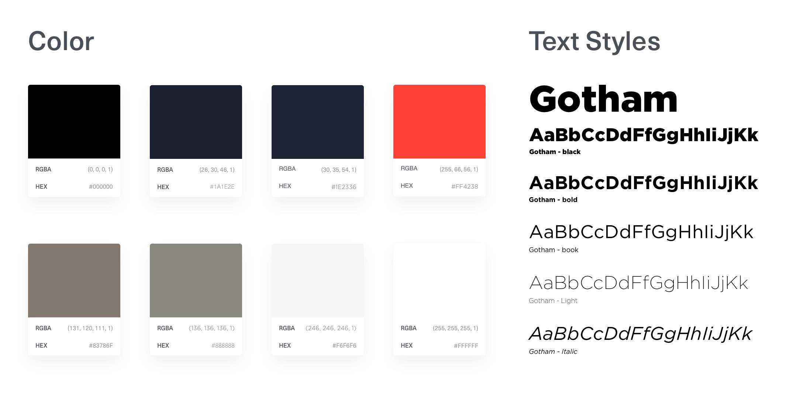

# Styleguide

#### Introduction

Because the Employee Benefit Program is realised by Peugeot Private Company, I chose to use their corporate identity. Peugeot Private Company did not provide their design system, so I had to create one on my own. I decided to use their colour scheme and typography. With these two layout elements, I create the rest of the design system within the designs.

