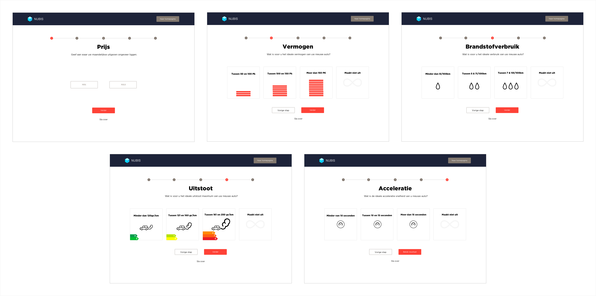

# Q&Onboarding V1

## Version 1

After I decided which concept I wanted to develop, I directly started with designing the first version. The survey I conducted gave me insights upon which aspects mattered the most when users buy a car. Based on these insights I created a questionnaire on-boarding with five questions. The questions subjects from one to five were: 

1. Monthly budget
2. Power level
3. Consumption level
4. Pollution level
5. Acceleration speed

  
The first question, about the monthly budget, had the option to give an indication what the minimum and maximum budget could be. The other four questions provided four options. Three levels, from low to high \(e.g. less than 100 kW, between 100 and 150 kW, and above 150 kW\), and an option which users could choose if they did not mind. 

### 

