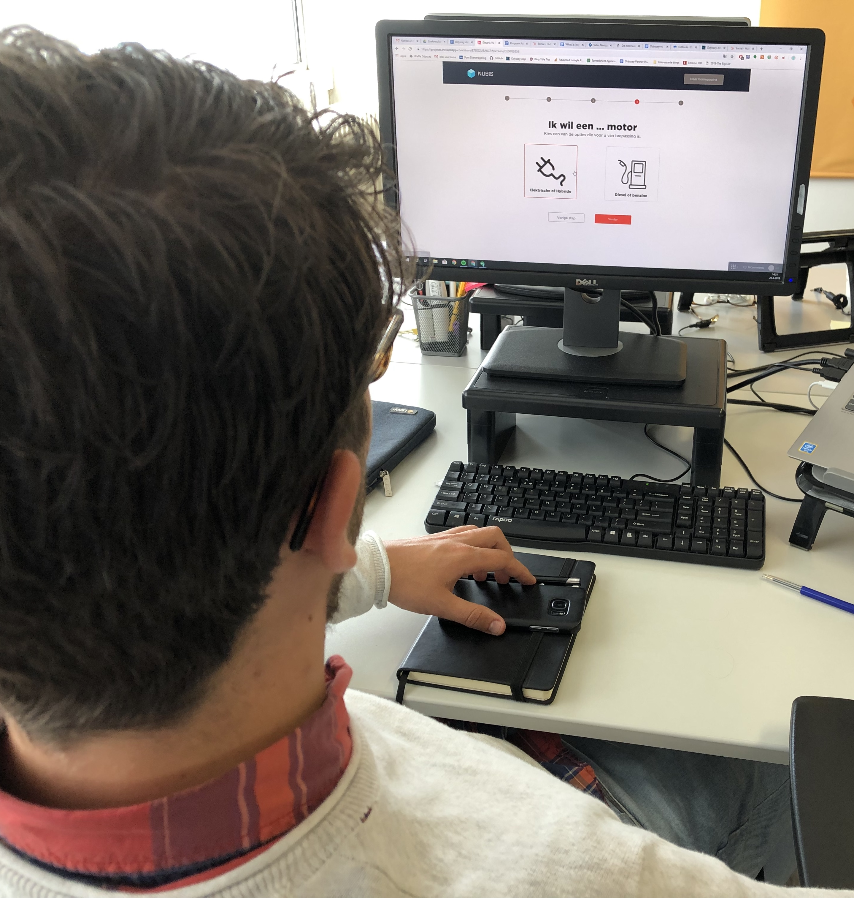

# Q&Onboarding V2 Tests

### Test

#### User test 1

The first test went really well. During the test I asked the participant about the thoughts of the questions. The participant immediately knew what was needed to fulfil the task. The participant easily found his way through the task but, had some questions about the options at two questions. The first was at the question about practical vs comfort. The participant pointed out that it wasn't 100% clear what 'practical' meant in comparison to comfort. The participant directly suggested an economical option. The second question occurred at the last question about the cargo space vs compact. The participant stated that that question felt similar to the third one about practical vs comfort. 

When I asked the participant what the participant thought of the questionnaire, the reaction was highly positive. The fact that a system could generate the best selection of vehicles by answering five short questions turned out to be personal and user friendly. 

The participant, however, mentioned some details. **As follow up on the notes at the questions, the participant said more visuals clues or explanation would help during the questionnaire.** For example, when the participant did not know what to choose, the participant looked for additional information about the answer. The participant for example mentioned what is included when the participants chooses for a practical vehicle. A small car icon with highlighted features would do the trick, the participant mentioned. 

In addition, the participant felt something was missing. The participant wanted a question where users have the option to choose between prefixed models or a high level of customisation. The participant concluded by saying that in the future, whenever the participant would sign a first contract the system would contribute to a better user experience.

### User test 2

When I showed the prototype to the second user, the user directly was enthusiastic about the intention of the product. The user specifically stated that the product **would be valuable for people who have knowledge about their situation \(e.g. Contracted with the opportunity to have a lease car\), but do not know what kind of car or contract they want and how to get there.** 

When we examined the substance of the questions, the user was doubting the which subject were applied. As an example, the user mentioned the third question between _quick & viable vs. strong & adventurous_. The illustrations \(a city for the first option, and a road for the second\), were not applicable for every situation, the user stated. **The user tended to choose for quick & viable because the user lived in the city, but at the same time the user could have wanted a car that's not necessarily build for the city, the user continued. This meant that the options overlapped each other.** 

In follow up on the subjects of questions the user addressed _practical vs. comfort ._ **Namely, the user said that comfort arises from practicalness.** The user maintained, by saying that the user's comfort would be a layback chair with a high-tech dashboard. The user suggested to replace the option _Comfort_  with _Luxury._ In the first place I thought that would be a well replacement, but then I thought:  'What would be considered as luxury?'. Which features of a car are known as 'luxury'  and which as 'Comfort'. 

The last question, _Cargo space & Seats vs. Compact & Agile_, did overlapped too much with the third question. In the user's opinion, the option represent a small vs a big car \(or city vs. off road\). Then the user came up with a suggestion. Because the question was not directly useless, **the user suggested to add a follow up question, to improve the filtering.** The user mentioned, that the third question mainly represents city vs. SUV, and the fifth could function as a filter. Instead of only representing SUV's, it could filter down to station wagons and other bigger vehicles. 

Another thing the user mentioned, was the face that the words that were used for the answers, were too abstract. **The words that are used can be interpreted differently by every person.** The user stated the this can easily cause mistakes when answering the questions. Quick may sound cool, but is not a main aspect a users looks for in a car. 

When I asked the user if the user would pay for the service, the user said: "In the current situation, I won't. But when this product is better developed and it reduces the time finding the car , I might use this. However, I am saying this from a rational point of view, my first intuition was not too. I do not think I am the right person to use this product, because I would actually like looking for a car. People who do not have knowledge about cars, are likely, in my opinion, to use this product."

**User test 3**

From the start of the third test, the user directly stated that the title and copy text of the first page were confusing. The title asked a question, so the user thought there should be an answer as well. **The second thing the user found unusual, was the fact that the user first had to click an answer and then click continue.** The user said that is was more likely, that when choosing an answer, the system brought the user to the next question. **Also, the way the questions were stated \(filling in the sentence\) did not feel challenging. As the approach of the questions were the same every time, the user suggested to try different approaches to make it more fun and diverse**. As last, the 'go to result' button at the last page had the same styling as the  'next question' button. The user said this could be better designed to get a better indication of what is happening next. 


Link to the second prototype: [https://invis.io/E7RO2UEA6CZ](https://invis.io/E7RO2UEA6CZ)


## 

