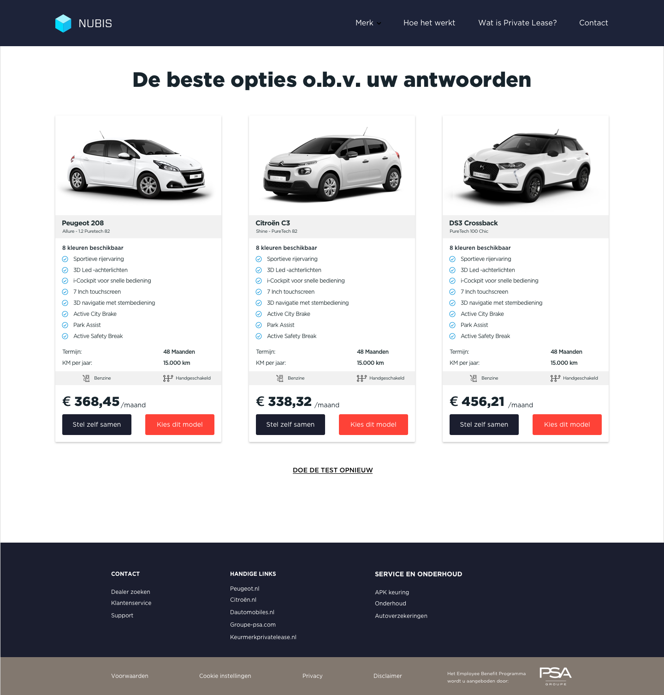
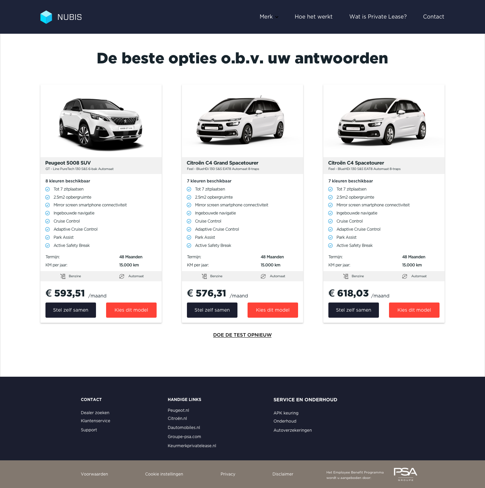

# Q&Onboarding V4.1 & V4.2

### Introduction

After the green-light presentation, I decided to take the feedback from my mentors into account and add the budget indication as a question. In the first version of the Q&Onboarding, I asked for a minimum and maximum price, in the new version I want to use only one price. In this way users simply can what consider to pay as a monthly fee. When the users receives their offer, they get an indication of the possibilities and how much it differs from their offer. It is up to the user to decide if they pay a little bit less or more for the desired car. 

Another subject I decided to add was gender. As women and men have a different perspective of the car's identity, the questionnaire needs two different approaches. One for men, and one for women. Men tend to be more image conscious and let emotion influence their buying, whereas women tend to be more utility minded. Also, men and women differ from each other in values. For men a car has to have personality, which means they look at the interior layout and technology. Women on the other hand, see a car as something practical which means they look at durability and reliability. 

## **Demographic data!!!!!!**

### Development

In the final design sprint in decided to rapid prototype two versions of the onboarding. To enlighten the ranking system I wanted to compare it with another approach. As the first two approach did not contribute to an enclosed system, I made some adjustments. In the first place, for both approaches I added a personal aspect. Helix sleep, let you find the right mattress, by asking simple questions. In order to make it personal, users need to fill their names and some personal preferences. The take your into account and use it to state the rest of the questions. They also ask what size of your mattress should be and for how many persons. To create something similar, I used the same approach, but used different questions. The questions I wanted to ask are: 

* What is your name ?
* What is your gender?
* What is you age?
* Where do you live?
* Do you have children?

The answer to the questions should contribute to the default selections later on in the questionnaire. For example, if you are a girl, with an age of 25 living in the city you will be likely to choose a small car which is easy to park and is low in consumption. Within the ranking, the categories should guide them into the right direction. In this case, space would be ranked as fifth, and consumption or sustainable as first or second. Within the type of car approach, a city car, would be selected as default. In addition, the user itself still needs to choose which is more valuable to themselves. The demographic data is just to guide them.

In the second place, I stated two earlier approaches. The question about the type of car and the ranking. I found a way to prototype the ranking in a digital way by using Framer X design tool. In this way, I was able to test the whole process. The subjects that needed to be ranked were:

* Space
* Sustainability
* Consumption
* Speed
* Luxury

The onboarding approach of the second version was to find the right type of car, in this version I decided to let the user choose the type beforehand.  Based on the type of car the onboarding could easily narrow down the possible outcomes. The type of cars were: 

* City car
* Compact 
* Berline \(Sedan\)
* Family car
* SUV
* MPV \(Multi Purpose Vehicle\)

As the approach of the questionnaire was slightly different, I decided to add a question of monthly budget to the ranking system, and not to type of car. Because the ranking is more preference based the question money could narrow it down more easily. The type of, in my opinion, was too nuanced to add the money budget question. If someone would fill in a monthly budget of 400 euros, all SUV and MPV option, instantly disappear. In the end, I want users to find the right car based on their real needs not their first thoughts. 

In order to obtain information about the contract I decided to add two questions. One about fuel and transmission and one about mileage. Fuel and transmission, in most occasions, are already determine by most users. Depending on the situation, users will have to choose between gasoline, hybride or diesel. Also, users can choose whether they want a manual or automatic transmission. 

As a service I wanted to add an automatic calculation for the mileage. The Employee Benefit Program is a private lease service, but the users can sign a contract for a car that could be used on business as well. Therefore, I asked the users if they drive only for private purposes, work purposes or both. Because everybody has different driving behaviour, I chose not to implement a calculation option for the private only option. For the other options, I added a follow up question in which a user needed to fill in the distance from their home address to their work address. In this way, the system could calculate how much kilometers someone drives on business and take that into account for the calculation. If someone does not know the exact distance between home and work, I added an google maps integration so users can calculate it themselves. 

Finally, the last question of the type of car approach was about the level of luxury \(or amount of options\). In the ranking system, the level of luxury need to be ranked in the second question, it his case the level of luxury is provided in three levels:

* Standard
* Advanced
* Premium

Standard provides only the basic options for people who only need a car for transport. Advanced includes more specific specifications for people who want a more pleasurable experience. And luxury consists only of premium versions. 

After all the information is collected, the system is able to generate a suited offer. Based on the answers a variety of models are able to be part of the selection. Therefore, I made six different scenario's that could play part. _These scenario are assumptions, based on own experiences_. I will elaborate the scenario's in the following section.

## Scenario's

### 1. Single Young Urban Professional 

I am woman of 27 living in the city who just graduated studying law. I am want a small car I am can easily park at every place in the city which is low on consumption. I like a good driving experience by having a manual transmission and because I only use my car small private distances, I will have gasoline as a fuel.

### 2. Starter with a relationship who moved out of the city

I am a 32 year old man in a relationship who just moved out of the city with a static income. I now have my own parking lot, and have more money to spend on a nice car. I am sportive driver, and because I do not have children I do not need a lot space or seats. I use my car to go work which is only 10 minutes away. My girlfriend only travels by bicycle, and if the weather is nice I am likely to take the bicycle instead as well.

### 3. Middle-aged married man, with adult children, living in a quiet village

I am a 48 year old married man who lives in a small village with 2 adult children who study in the city. Me and my wife like to go on city trips by car and often visit family. As I like comfort, I want automatic transmission and because the travelling distances aren't that far I use gasoline for as a fuel .

### 4. Family man who needs a car for practical reasons

I am 44 year old family man with 3 small children. I care about the planet, so I try to use my bicycle in most occasions. However, I need a car for the family and to go on holiday. My and my wife like to camp with the kids. A car is nothing more than a way of transportation to me, so I do not require any luxury specifications. 

### 5. Sportive adventurous couple with children

I am a 35 year old man and my wife is a 34 year old woman. Together we live in a village just outside the city with two small children. We like to go sportive holidays, whether it is winter sports or hiking. We like to go on holiday by car and always bringing our children. As we travel large distances we like to comfort, but also need cargo space to bring our gear. We both like driving sportive, so we choose for manual transmission. We do not use the car for work everyday, so choosing for gasoline as a fuel would be reasonable. 

### 6. Housewife who takes care of the children and householding

I am 38 year old housewife who lives in a venix-district who takes care of five children of different ages. During the week I am responsible to take the children to school and do groceries. I sport multiple times a week doing different exercises. My husband has to travel on business and has his own car. I prefer a lot of seats and cargo space to move my stuff and groceries. The distances I travel are short, so the car should be mainly practical.

#### 

