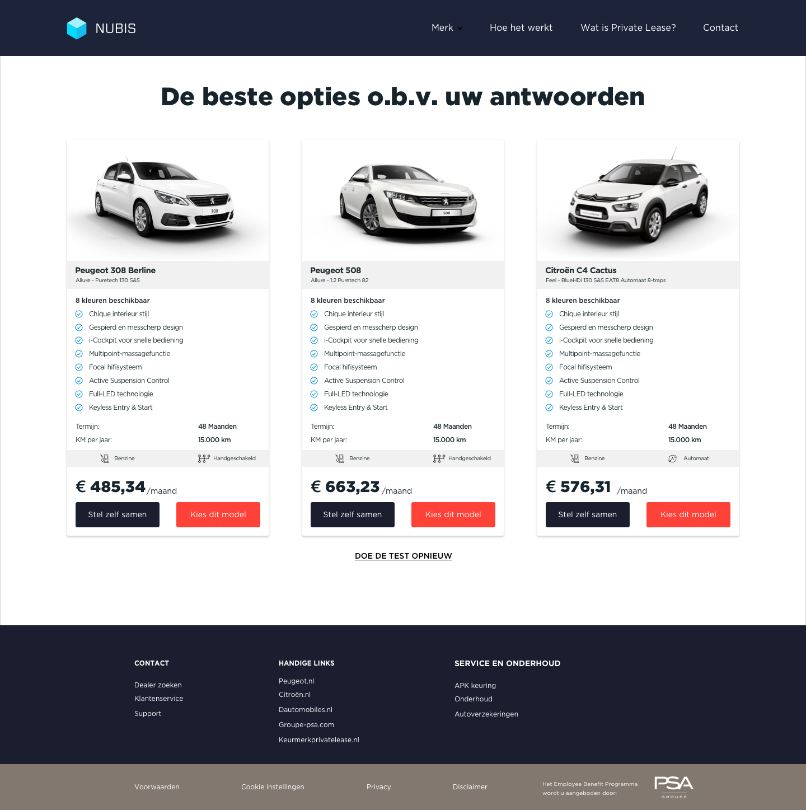

# Scenarios

#### Introduction

After all the information is collected, the system is able to generate a suited offer. Based on the answers a variety of models are able to be part of the selection. Therefore, I made six different scenario's that could play part. _These scenario are assumptions, based on own experiences_. I will elaborate the scenario's in the following section.

## Scenario's

### 1. Single Young Urban Professional 

I am woman of 27 living in the city who just graduated studying law. I am want a small car I am can easily park at every place in the city which is low on consumption. I like a good driving experience by having a manual transmission and because I only use my car small private distances, I will have gasoline as a fuel.

### 2. Starter with a relationship who moved out of the city

I am a 32 year old man in a relationship who just moved out of the city with a static income. I now have my own parking lot, and have more money to spend on a nice car. I am sportive driver, and because I do not have children I do not need a lot space or seats. I use my car to go work which is only 10 minutes away. My girlfriend only travels by bicycle, and if the weather is nice I am likely to take the bicycle instead as well.

### 3. Middle-aged married man, with adult children, living in a quiet village

I am a 48 year old married man who lives in a small village with 2 adult children who study in the city. Me and my wife like to go on city trips by car and often visit family. As I like comfort, I want automatic transmission and because the travelling distances aren't that far I use gasoline for as a fuel .

### 4. Family man who needs a car for practical reasons

I am 44 year old family man with 3 small children. I care about the planet, so I try to use my bicycle in most occasions. However, I need a car for the family and to go on holiday. My and my wife like to camp with the kids. A car is nothing more than a way of transportation to me, so I do not require any luxury specifications. 

### 5. Sportive adventurous couple with children

I am a 35 year old man and my wife is a 34 year old woman. Together we live in a village just outside the city with two small children. We like to go sportive holidays, whether it is winter sports or hiking. We like to go on holiday by car and always bringing our children. As we travel large distances we like to comfort, but also need cargo space to bring our gear. We both like driving sportive, so we choose for manual transmission. We do not use the car for work everyday, so choosing for gasoline as a fuel would be reasonable. 

### 6. Housewife who takes care of the children and householding

I am 38 year old housewife who lives in a venix-district who takes care of five children of different ages. During the week I am responsible to take the children to school and do groceries. I sport multiple times a week doing different exercises. My husband has to travel on business and has his own car. I prefer a lot of seats and cargo space to move my stuff and groceries. The distances I travel are short, so the car should be mainly practical.

#### 

